# GESTOR DE NOTAS
<div align="center">
  

  # Gestor de Notas Chili Morrón
  
  <p>
    Gestor de notas inspirado en el personaje de Sanrio <strong>Cinnamoroll</strong>.<br>
    Estética <em>dreamy & ethereal</em>, lógica robusta en Python.
  </p>

  
  
  
  
</div>


> Quiero hacer este proyecto con ciertas ideas que tengo en mente.
* **Arte ASCII**: Quiero incluir en `mostrar_menu()` un dibujillo de Cinnamoroll (pj de Sanrio que me encanta)
* **Colores**: Usando la libreria `rich` y con códigos `ANSI` crearé una paleta de colores bonitas y temática con la estética que busco :P Así puedo incluir el uso de markdown que lo domino y me gusta mucho :3
* **Categorías**: Siguiendo las ideas que das en el pdf, categorizar las notas por contenido! Incluiré también que muestre cuántas notas hay guardadas en total y la media de cuántos caracteres se usan para escribirlas~
* **Notion**: Como hice un proyecto de un widget de escritorio hace tiempo que lo tengo conectado a la bbdd de notion, me gustaría hacer lo mismo para este! Cada vez que meta una nota en la terminal que vaya directamente a notion
* **Easter egg**: Comandos secretos, dentro del menú poner royo una sección oculta por ejemplo Pokemon y que añadas ahí los pokemon que vayas capturando en algun juego.
* **Filtros**: Una función de limpieza que cada vez que escribas, por ejemplo, cubata, se detenga y muestre una alerta en plan "Alerta por borrachin/borrachina, ¿deseas continuar? (s/n)" o alguna cosa random HAHAHAH 

---

## Creación del archivo

Inicio creando el archivo `gestor_notas.py` en VSC.

Empiezo buscando el **arte ascii** de [cinnamoroll](https://emojicombos.com/cinnamoroll-ascii-art).

```bash
⠀⠀⡠⠂⠉⠉⠐⠄⠀⠀⠀⠀⠀⠀⠀⠀⠀⠀⠀⠀⠀⠀⠀⠀⠀⠀⠀⠀⠀⠀⠀⣀⣀⠀⠀⠀⠀
⠀⠸⠀⠀⠀⠀⠀⠘⡀⠀⠀⠀⠀⠀⠀⠀⠀⠀⠀⠀⠀⠀⠀⠀⠀⠀⠀⠀⠀⡠⠃⠀⠀⠀⢄⠀⠀
⠀⠇⠀⠀⠀⠀⠀⠀⠇⠀⠀⠀⠀⠀⠀⠀⠀⠀⠀⠀⠀⠀⠀⠀⠀⠀⠀⠀⢰⠀⠀⠀⠀⠀⠈⡆⠀
⢀⡃⠀⠀⠀⠀⠀⠀⢸⠀⠀⠀⠀⠀⠀⠀⠀⠀⠀⠀⠀⠀⠀⠀⠀⠀⠀⠀⢸⠀⠀⠀⠀⠀⠀⢰⠄
⠈⢡⠀⠀⠀⠀⠀⠀⠀⢧⠀⠀⠀⠀⠀⠀⣀⣀⣀⣀⣀⠀⠀⠀⠀⠀⠀⠀⢸⠀⠀⠀⠀⠀⠀⠸⠄
⠀⠀⠡⡀⠀⠀⠀⠀⠀⠀⠑⠦⡤⠖⠊⠉⠀⠀⠀⠀⠀⠉⠑⠢⣄⣀⡠⠴⠃⠀⠀⠀⠀⠀⢀⠇⠀
⠀⠀⠀⠁⢀⠀⠀⠀⠀⠀⠀⠀⠁⠀⠀⠀⠀⠀⠀⠀⠀⠀⠀⠀⠙⠋⠁⠀⠀⠀⠀⠀⠀⢀⡘⠀⠀
⠀⠀⠀⠀⠀⠁⠢⠄⣀⡠⠊⠀⠀⠀⠀⠀⠀⠀⠀⠀⠀⠀⠀⠀⠀⠀⠢⡀⠀⠀⠀⢀⠀⠋⠀⠀⠀
⠀⠀⠀⠀⠀⠀⠀⠀⠰⠁⠀⢠⢶⡂⠀⠀⠀⠀⠀⠀⠀⠀⠀⡴⢦⠀⠀⠙⡒⠒⠉⠀⠀⠀⠀⠀⠀
⠀⠀⠀⠀⠀⠀⠀⠀⢇⠀⠀⠈⠉⠁⠀⠀⠰⠤⠤⡴⠀⠀⠀⠈⠙⠀⠀⡀⡇⠀⠀⠀⠀⠀⠀⠀⠀
⠀⠀⠀⠀⠀⠀⠀⠀⠈⠓⣼⠋⢳⠀⠀⠀⠀⠈⠒⠀⠀⠀⠀⢠⠊⠙⣤⠊⠀⠀⠀⠀⠀⠀⠀⠀⠀
⠀⠀⠀⠀⠀⠀⠀⠀⠀⠀⠘⠀⠀⠑⠒⠒⠒⠒⠒⠒⠒⠒⠒⠋⡀⠐⠁⠀⠀⠀⠀⠀⠀⠀⠀⠀⠀
```

Ahora voy a instalar en la terminal las librerías usando:

```bash
pip install colorama rich requests
```

* **rich**: En los requisitos se especifica usar `colorama` pero yo quiero algo muy adorable y claro, colores pastel y tal, he bicheado por internet alternativas y me topé con esta de [rich](https://www.reddit.com/r/Python/comments/jyi8ku/better_python_console_apps_with_rich/?tl=es-es). Te permite hacer cosas brutales muy facilmente como el `Panel` jeje
* **requests**: Como quiero conectarla a la api de notion... Hace tiempo hice un proyectillo personal como puse arriba. Me mola mucho usar apis jeje y el resultado es una gozada, me facilita mucho la vida jeje Así que me gustaría trasladarlo aquí para que las notas se suban solas. Buscando cómo hacerlo y hacer peticiones http para python vi que el estandar es [`requests`](https://j2logo.com/python/python-requests-peticiones-http/) por ser sencilla :3

Una vez instaladas las llamo dentro del proyecto usando `import` arribita del todo!

Con `rich` importado me monto una consola para poder imprimirlo todo así kawaii en vez de usar el `print` clásico de siempre, por ende usaré `consola.print()`.

## Diseño del `mostrar_menu()`

Aquí meto a mi cinnamoroll. Para no romper el dibujo en la terminal lo guardo en una variable usando `r"""..."""` (para que lea los caracteres tal cual) y le doy un color azul pastel con las etiquetas de `rich` (`[bold light_cyan3]`) <3

Después creo el menú de opciones. En lugar de texto plano uso un `Panel` de `rich` para que me haga un cuadrado rosita con bordes redondeados (se rompe un poco a la derecha, no sé si hice algo mal x.x)

## `main()`

Me creo la lista vacía de `notas = []` donde irán guardándose los diccionarios y abro un bucle `while true` para que el menú se repita hasta que el usuario decida salirse.

Teniendo en cuenta la [Jesubiblia](https://github.com/SugusGamberra/JesubibliaDePython) en el **Versículo 3:1** para hacer el menú. El cuerpo me pedía usar `match-case` pero sigo al dedillo la sabiduría de Jesús Deidad y no acometer al pecado 👀 ya que también en los requisitos del proyecto se pide usar estos condicionales, así que he sido buena cristiana 🙂‍

Para los easter eggs (que claro, trampuchis porque verás el código y sabrás cuáles son 😢) en la validación del menú he colocado 2 comandos secretos. Si en vez de número escribes otra palabra, se abre un "portal" oculto 🫢

Por el momento se ve así:


> Por hoy lo dejo aquí, seguiré poquito a poco en próximos días

---

## Implementación de las opciones

### Ver notas

Para visualizar las notas voy a usar de la librería `rich`las tablas, así que la importo arriba del todo!

Ahora crearé la función antes del `main()` ya que **python** es un lenguaje interpretado que lee el código de forma secuencial, de arriba a abajo. Si se llama `ver_notas()` o `mostrar_menu()` dentro del bucle principal antes de haberlas creado tiraria un error. Al definirlas primero cuando el programa llega al `if __name__ == "__main__":` y ejecuta el `main()`, tiene ahi guardadas en memoria todas las instrucciones que encesita usar jeje:

1. Para evitar que el programa se rompa ni haga cosas raras, si el usuario pide ver las notas y aún no hay ninguna creo un condicional en el que `if not notas` (si la lista está vacía) imprime un mensaje animando a escribir y usa un `return` para salir de la función.
2. En vez de imprimir los diccionarios en texto plano, con `Table` he configurado las columnas `nº`, `titulo`, `categoria` y `contenido` siguiendo la estética adorable en toda la terminal :3
3. Para rellenar la tabla, el proyecto pedía que las notas se mostraran numeradas. En vez de crear una variable contador (tipo `i = 1`) e ir sumando en cada vuelta, he usado un bucle `for` apoyado en la funcion nativa `enumerate(notas, start=1)`. Esto saca automáticamente el índice para la columna de `nº` como el propio diccionario de l anota.
4. He ampliado aquí con la idea de las estadísticas de las notas creando una varibale `total_longitud = 0` antes del bucle. Dentro de este en cada pasada le voy sumando la longitud del contenido de la nota (`len(nota["contenido"])`) y cuando termina el bucle se calcula la media dividiendo el total entre el número de notas (`len(notas)`)

Ahora para poder sacarla la conecto al `main()` en la opción 2.

He hardcodeado 2 notas para poder ver el resultado:
```py
notas = [
        {"titulo": "Prueba nota 1", "categoria": "Proyectos", "contenido": "Probando como se visualiza en la terminal"},
        {"titulo": "hola mundo", "categoria": "Ocio", "contenido": "hello wordl"}
    ]
```

Y además he añadido al final del bucle un `input` que me permita pulsar enter para continuar, era muy molesto intentar ver las notas y que saltara el menú de nuevo...

Por ahora se ve así:

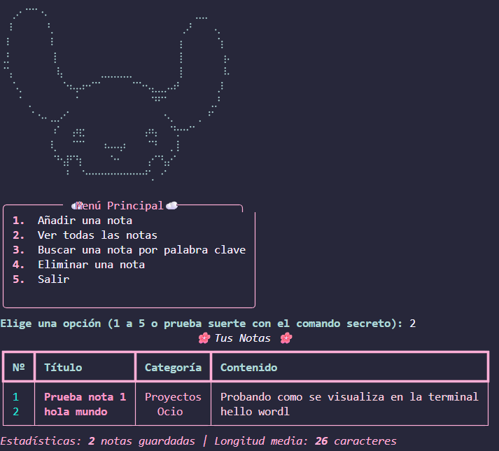

### Añadir notas

Ahora vamos a crear la función de `add_nota(notas)` para quitar lo hardcodeado!

Con esta opción alimentamos la lista de diccionarios. Para hacerla super completa:

1. **Recogida de datos:** Usando `consola.input()` pido el título, la categoría y el contenido. Les aplico `.strip()` al final para limpiar los espacios en blanco accidentales que pueda dejar el usuario al principio o al final de la frase.
2. **Filtro de Validación (Easter Egg):** Antes de procesar nada, he metido mi función de limpieza. Usando el operador `in`, compruebo si cierta palabra que no queremos que exista este en el contenido o en el título (usando `.lower()` para que no importe si lo escriben en mayúsculas). Si es así, freno la ejecución y lanzo un `input` de alerta. Si el usuario elige 'n', uso un `return` para abortar la función al instante.
3. **Control de duplicados:** El PDF exige que si un título ya existe, el programa pregunte si queremos sobreescribirlo. Para ello, recorro la lista actual con un `for nota in notas`. Si encuentro una coincidencia de títulos, pregunto. Si la respuesta es afirmativa, actualizo las claves `categoria` y `contenido` de ese diccionario directamente y salgo con un `return`.
4. **Confirmación y Guardado:** Si el título es nuevo y ha pasado los filtros, cumplo con el último requisito del PDF pidiendo confirmación final (`¿Guardar esta nota? (s/n)`). Si es un sí, meto las tres variables en un diccionario nuevo `{...}` y uso el método `.append()` para inyectarlo al final de la lista `notas`.

Ahora, para ver como funciona en terminal:

- Creación de una nota normal y corriente

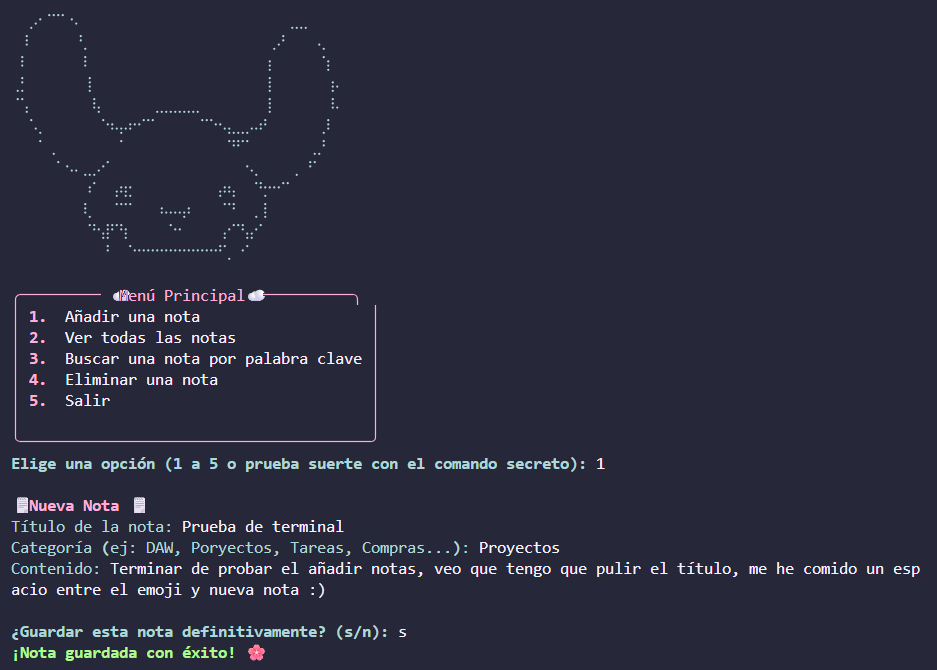

- Creación de una nota con la palabra del filtro en título y cuerpo. En la primera imagen acepto el guardar la nota y en la segunda rechazo:

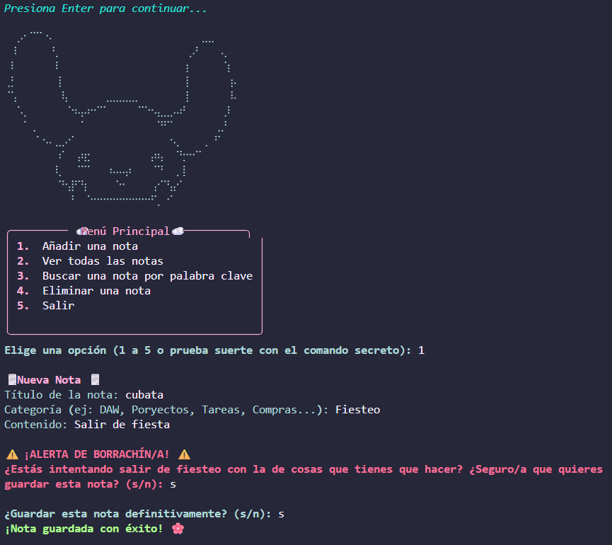
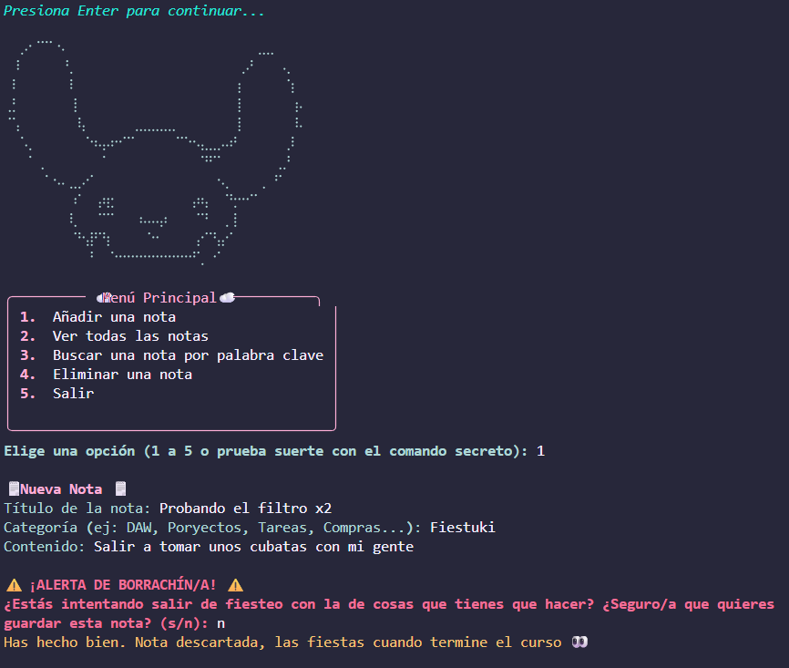

- Visualización de que las notas se han guardado correctamente:

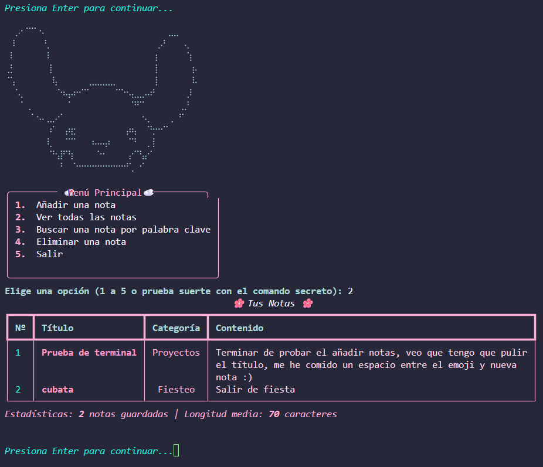

> Por hoy desconecto! Mañana sigo :3 (Quiero dejar super bien especificado absolutamente todo, así que sorry por ser tan transparente HAHAHAH mi vena de laboratorio me anima a apuntar absolutamente TODO)

### Buscar una nota

Esta es la opción 3 y nos pide buscar una palabra clave tanto en el título como en el contenido. He creado la función `buscar_nota(notas)` y la he estructurado así:

1. **Control inicial:** Al igual que en la opción 2, hago un `if not notas:` para salir rápido de la función si la lista está vacía y no hacer trabajar al programa a lo tonto.
2. **Transformación a minúsculas:** El PDF exige que la búsqueda no distinga mayúsculas de minúsculas. Para solucionarlo, aplico el método `.lower()` tanto a la palabra que introduce el usuario como a los textos de los diccionarios a la hora de compararlos, así nunca falla
3. **Guardado de resultados:** Creo una lista vacía llamada `encontradas = []`. Uso un bucle `for` con `enumerate` para recorrer las notas. Si la palabra clave está `in` el título `or` `in` el contenido, añado una pequeña tupla a mi lista de encontradas guardando su índice original y la nota en sí.
4. **Renderizado visual:** Si la lista de `encontradas` tiene algo, vuelvo a aprovechar el poder de `rich.Table` para imprimir solo las notas que han hecho *match*, manteniendo intacto su número original (así si luego el usuario quiere borrarla en la opción 4, sabrá exactamente qué número introducir). Si la lista está vacía, saco un texto en rojo indicando que no hay coincidencias.

Vemos como la nota está guardada:

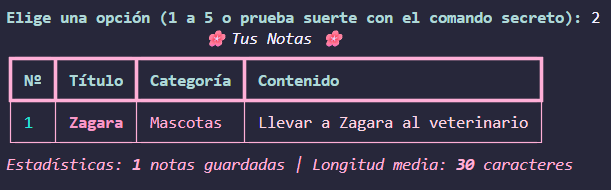

Buscamos por palabra clave probando que efectivamente da igual dónde situes mayúsculas o minúsculas siempre que escribas la palabra que sea a buscar:

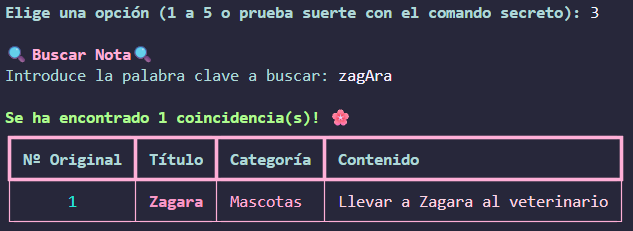

### Eliminar una nota

La opción 4 nos expideige mostrar las notas, pedir un número, tolerar que el usuario meta letras por error sin que el programa pete, y confirmar la acción antes de borrar nada. La función `eliminar_nota(notas)` resuelve todo esto así:

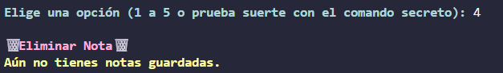

1. **Reutilización de código (DRY):** Para mostrar la lista de notas numeradas, en lugar de volver a escribir un bucle `for`, he llamado directamente a mi propia función `ver_notas(notas)` dentro de esta. Aprovecho el código y la tabla de `rich`.

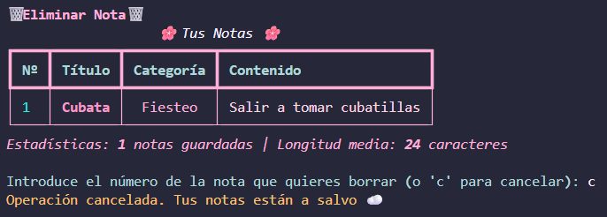

2. **Validación de errores (`.isdigit()`):** Al pedir el número con un `input()`, el dato entra como *String*. Si yo intento hacer un `int("hola")`, Python lanzaría un error y el programa se cerraría de golpe. Para evitarlo, uso el método de cadenas `.isdigit()`, que devuelve `True` solo si todos los caracteres son números. Si mete letras, salta mi aviso en rojo y un `return` le devuelve al menú principal sanos y salvos :P

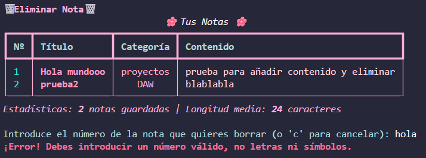

3. **Lógica de índices:** Si el usuario pasa la validación, convierto el texto a número. Para comprobar que no me pide borrar la nota 99 si solo tengo 2, verifico que el número esté en el rango `1 <= numero <= len(notas)`. 

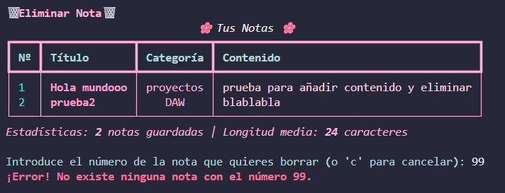

4. **Borrado con `.pop()`:** Pido confirmación final. Como el usuario ve las notas empezando por el número 1, pero las listas en Python empiezan a contar desde el índice 0, para acceder a la nota correcta le resto uno al número introducido (`numero - 1`). Una vez confirmada la acción, uso el método de listas `.pop(numero - 1)` para extraer y eliminar ese diccionario de nuestra lista `notas`.

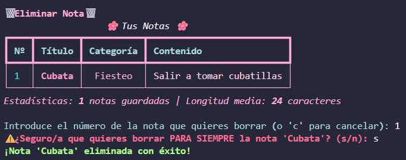

---

## Request para Notion

### Seteando Notion

He creado ya el espacio de [Notion](https://amenable-end-6ee.notion.site/Gestor-de-Notas-Proyecto-Python-32fa70607c7380ffb7cad909894dfe8c) para preparar la tabla que actuará como BBDD. Ahora, para integrarlo, tengo que crear el token en [mis integraciones](https://www.notion.so/profile/integrations/internal).

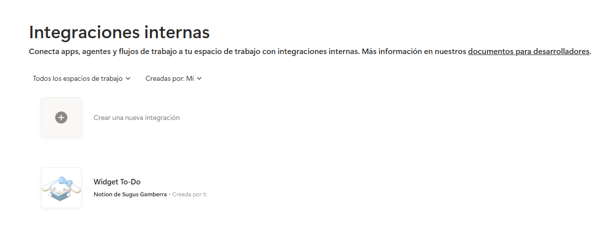

Sencillamente creo una **nueva integración**, le pondré de nombre "conector python", la subo y saco el TOKEN.

> **Seguridad de credenciales (`python-dotenv`):** Como quería conectar la API de Notion, tenía que manejar un Token secreto y un ID de base de datos. Subir eso "hardcodeado" a GitHub es un peligro enorme. He replicado la estructura de variables de entorno usando un archivo `.env` (incluido en mi `.gitignore`) y la librería `python-dotenv`. Con `load_dotenv()` y `os.getenv()` consigo que mi script lea las claves localmente de forma 100% segura. Ciberseguridad básica jiji <3

Lo siguiente es, desde la página de la bbdd de notion, saco de la barra de direcciones el ID (que es los numeros que van despues del último guión y antes del `?`) y lo añado al `.env`.

Lo último para **Notion** será darle permisos, que es arriba a la derecha en los tres puntitos de la página, **conexiones**, selecciono mi integración y confirmo el acceso ;3

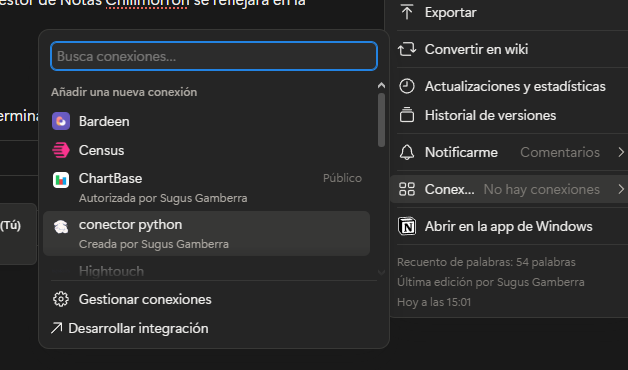
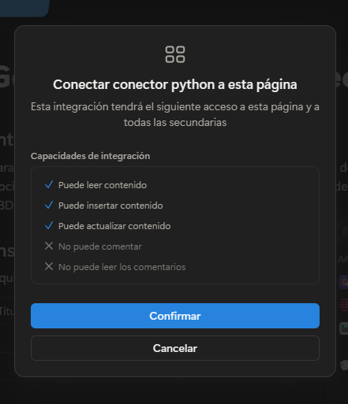

Bueno, claro, en Notion he creado la tabla para la base de datos respetando los nombres de cada columna sin cambiar nadísima.

### Función para subir a notion

Con las credenciales ya a salvo, me puse a picar la función `subir_a_notion(titulo, categoria, contenido)`. Aquí es donde la librería `requests` actua

Lo que hace la función es súper directo:

1. **La URL y las Cabeceras**: Apunto a la API de Notion (`https://api.notion.com/v1/pages`) y le paso mi token y la versión de la API por las cabeceras para que me deje entrar y reconozca quién soy.
2. **El Payload (JSON)**: Traduzco los datos de mi nota (título, categoría y contenido) al formato exacto de diccionarios anidados que exige Notion para rellenar las columnas.
3. **La Petición POST y Control de Errores**: Uso un bloque `try/except` para hacer la llamada con `requests.post()`. Si el servidor de Notion me devuelve un código `HTTP 200` (todo OK), imprimo un mensajito verde en la terminal confirmando que se ha hecho. Si falla algo (por ejemplo, si no hay internet), capturo el error (`Exception`) para que el programa no pete y me avise con un mensaje en rojo.

Esto se ejecuta en la función de `add_nota()` (la Opción 1 del menú) y, justo al final, después de comprobar que el usuario ha confirmado que quiere guardar la nota y de asegurarme de que el texto ha superado mi filtro llamo a la función pasándole las tres variables.

Probamos que funcione y...

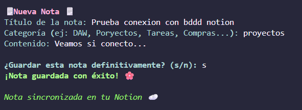

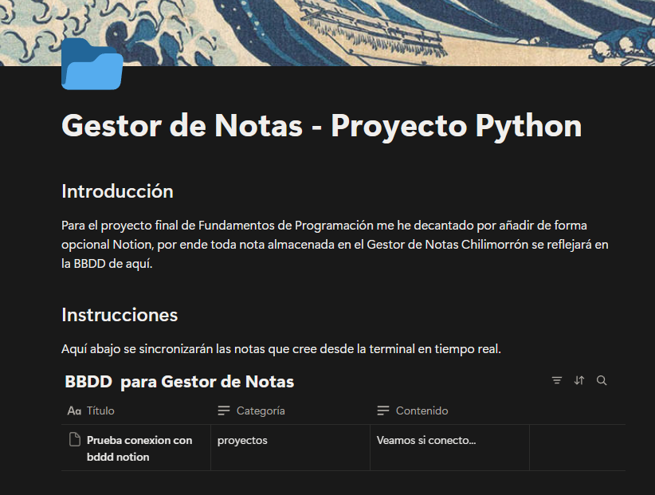

### Funcion paraa descargar de Notion

Como ahora cada que cerramos la consola y la abrimos le da amnesia, voy a crear una función que haga una consulta a la API de notion (aasí no guarrineamos nuestro pc llenándolo de cosas y archivos "basura") y  lea lo que hay y lo muestre en la terminal :P

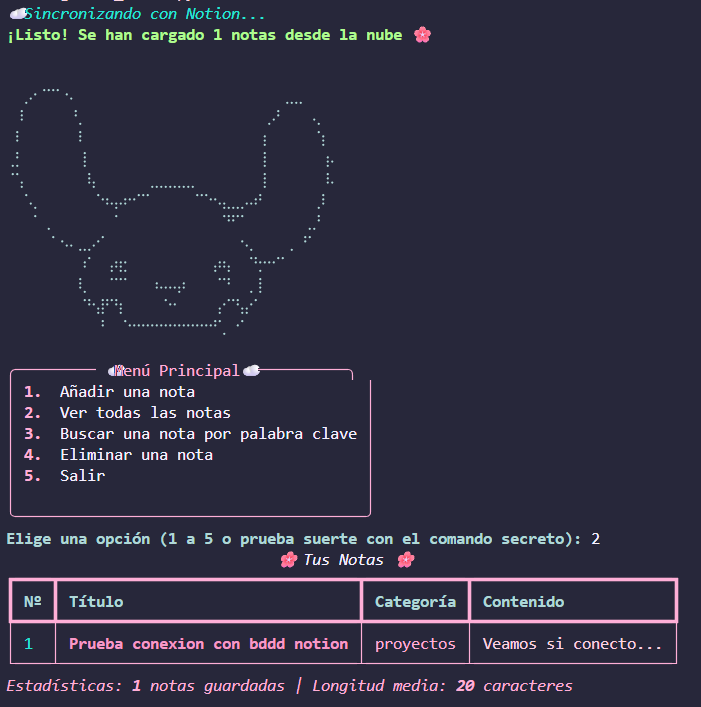

Para conseguir esta sincronización, he creado la función `descargar_de_notion()`. Extraer datos de la API de Notion es un poco laberíntico por cómo estructuran su JSON, así que lo he resuelto en estos pasos:

1. **El Endpoint `/query`**: Para leer el contenido de una base de datos, Notion nos pide hacer una petición `POST` (curiosamente no es un `GET`) a la ruta `/query` de nuestra tabla. Por supuesto, le paso mi `NOTION_TOKEN` en las cabeceras para que me abra las puertas.
2. **Desempaquetando el JSON**: Si la respuesta es un `200` (todo OK), convierto el paquete con `respuesta.json()` y extraigo la lista principal que viene dentro de la clave `"results"`. Ahí es donde está cada una de las filas de mi tabla.
3. **Programación defensiva con `.get()`**: En Notion es muy fácil dejar una celda en blanco por accidente. Si en mi código intento leer una celda vacía a lo bruto (ej: `props["Categoría"]`), Python me lanzaría un error rompiendo todo el programa y mi paz mental :) Para evitarlo uso el método `.get()`. Si el dato no existe, me devuelve un valor vacío de forma segura y yo le asigno un texto por defecto (como "Sin contenido" o "General").
4. **Arranque en el `main()`**: Una vez que el bucle `for` reconstruye todos los diccionarios con el título, categoría y contenido, la función devuelve la lista llena. Finalmente, me fui a mi `def main()` y cambié la variable inicial: en lugar de arrancar con un `notas = []` vacío, ahora arranca ejecutando `notas = descargar_de_notion()`.

Así, nada más ejecutar el script, el programa se conecta a la nube, absorbe la información y me rellena el menú con mis apuntes listos para usar ;3

# ALERTA D SPOILER!!!

> Estos son los menuse secretos, si no quieres hacerte spoiler no leas 👀👀👀👀

## Easter Eggs

### Pokemon

Como me encantan los detalles ocultos y darle personalidad a mis proyectos, decidí programar comandos secretos en la validación del menú principal. Si el usuario escribe **pokemon** en lugar de un número se abre una Pokédex funcional conectada a internet en tiempo real.

Para hacer esto realidad, he creado la función `abrir_pokedex()` y he vuelto a usar la librería `requests`, pero esta vez consumiendo la **PokeAPI** (una API pública y gratuita):

1. **Submenú aislado**: La función atrapa al usuario en su propio bucle `while True`. Así puede buscar todos los Pokémon que quiera de forma seguida sin que el menú principal vuelva a saltar hasta que escriba la palabra `salir`.

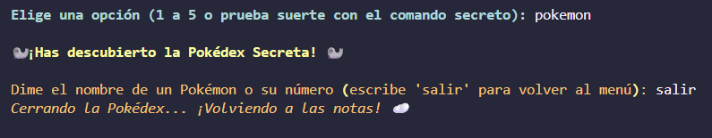

2. **Petición GET**: Al ser una API pública, no necesito tokens ni cabeceras complejas. Simplemente hago un `requests.get()` inyectando el nombre del Pokémon que escribe el usuario directamente en la URL.

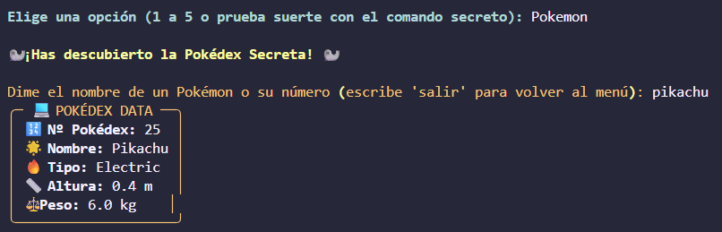

3. **Transformación de datos (Data Parsing)**: La API devuelve un JSON gigante. Extraigo solo lo vital (nombre, ID, tipos, altura y peso). Como la API devuelve la altura en decímetros y el peso en hectogramos, hago la conversión matemática (`/ 10`) en las propias variables para mostrar metros y kilos reales. Para limpiar los tipos (que vienen en una lista de diccionarios) uso `list comprehensions` y el método `.join()`.

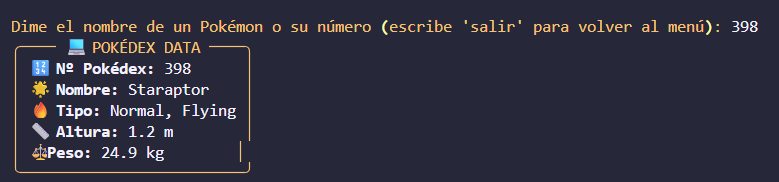

4. **Renderizado con ric**h: Empaqueto toda esa información limpia en una variable y uso el componente `Panel` de `rich` para imprimirlo con bordes amarillos
5. **Control de errores (Try/Except)**: Si el usuario se inventa un nombre o escribe mal, la API devuelve un código distinto a 200 (normalmente un 404). Mi código lo detecta y en vez de crashear, saca un aviso amistoso en rojo. También capturo las excepciones de conexión por si nos quedamos sin internet.

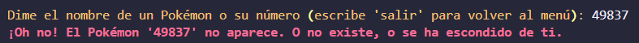

### Suerte

Como no podía ser de otra forma, mi vena espiritual me pedía a gritos meter una tirada de Tarot en la opción de la suerte. Pero en lugar de ser conformista y simplemente copiar un diccionario gigante de cartas en mi código de Python, decidí llevar el proyecto al siguiente nivel: conectar este gestor local con un proyecto mio personal, un ecosistema de proyectos completo jeje :P

1. **Creación de mi propia API (Lado Web)**: En el proyecto de mi web (desplegado en Vercel y hecho con Astro), las cartas viven en un archivo de datos. Para poder sacarlas de ahí, me creé un nuevo endpoint que coge ese diccionario de cartas y lo expone en formato JSON

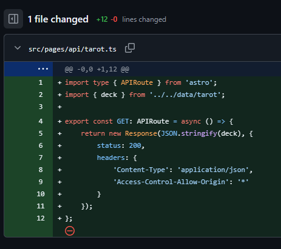

2. **Consumo de la API (Lado Python)**: De vuelta a mi gestor de notas local, importé la librería nativa `random`. En la función `tirar_carta_suerte()`, uso de nuevo `requests.get()` para llamar directamente a la URL de mi propia web.
3. **Aleatoriedad**: Una vez que Python recibe el paquete JSON con las 78 cartas uso `random.choice(cartas)` para que coja una al azar

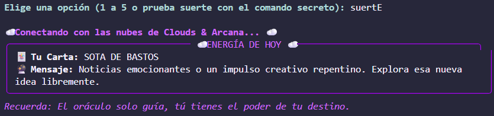

4. **Renderizado**: Eextraigo el nombre y el mensaje de esa carta ganadora y lo imprimo en la consola usando un `Panel` de `rich`.

Lo wapo de esto es que están sincronizados. Si el día de mañana decido actualizar el mensaje de "La Emperatriz" o añadir más cartas en el código de mi web, mi gestor de notas de Python se actualizará al instante sin tener que picar nada de codigo jeje

---

> Y hasta aquí, fin del proyecto!! He intentado documentar el proceso de creación de absolutamente todo para que quede constancia, de forma más cercana, todos los pasos dados para obtener un gestor de notas bonito bonito :P