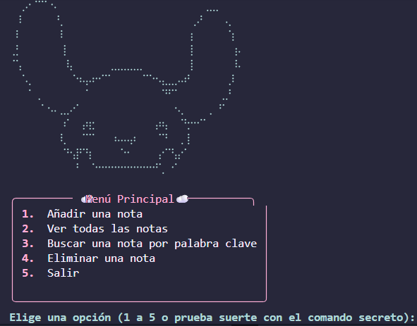

# GESTOR DE NOTAS


---

> Quiero hacer este proyecto con ciertas ideas que tengo en mente.
> **Arte ASCII**: Quiero incluir en `mostrar_menu()` un dibujillo de Cinnamoroll (pj de Sanrio que me encanta)
> **Colores**: Usando la libreria `colorama` e intentando con códigos `ANSI` crear una paleta de colores bonitas y temática con la estética que busco :P Miraré otras librerías como `rich` para imprimir en consola por ejemplo todas las notas como una tabla, y como me mola mogollón markdown y lo manejo guay pues :P
> **Categorías**: Siguiendo las ideas que das en el pdf, categorizar las notas por contenido! Incluiré también que muestre cuántas notas hay guardadas en total ~
> **Notion**: Como hice un proyecto de un widget de escritorio hace tiempo que lo tengo conectado a la bbdd de notion, me gustaría hacer lo mismo para este! Cada vez que meta una nota en la terminal que vaya directamente a notion
> **Easter egg**: Comandos secretos, dentro del menú poner royo una sección oculta por ejemplo Pokemon y que añadas ahí los pokemon que vayas capturando en algun juego.
> **Filtros**: Una función de limpieza que cada vez que escribas, por ejemplo, cubata, se detenga y muestre una alerta en plan "Alerta por borrachin/borrachina, ¿deseas continuar? (s/n)" o alguna cosa random HAHAHAH 

---

## Creación del archivo

Inicio creando el archivo `gestor_notas.py` en VSC.

Empiezo buscando el **arte ascii** de [cinnamoroll](https://emojicombos.com/cinnamoroll-ascii-art).

```bash
⠀⠀⡠⠂⠉⠉⠐⠄⠀⠀⠀⠀⠀⠀⠀⠀⠀⠀⠀⠀⠀⠀⠀⠀⠀⠀⠀⠀⠀⠀⠀⣀⣀⠀⠀⠀⠀
⠀⠸⠀⠀⠀⠀⠀⠘⡀⠀⠀⠀⠀⠀⠀⠀⠀⠀⠀⠀⠀⠀⠀⠀⠀⠀⠀⠀⠀⡠⠃⠀⠀⠀⢄⠀⠀
⠀⠇⠀⠀⠀⠀⠀⠀⠇⠀⠀⠀⠀⠀⠀⠀⠀⠀⠀⠀⠀⠀⠀⠀⠀⠀⠀⠀⢰⠀⠀⠀⠀⠀⠈⡆⠀
⢀⡃⠀⠀⠀⠀⠀⠀⢸⠀⠀⠀⠀⠀⠀⠀⠀⠀⠀⠀⠀⠀⠀⠀⠀⠀⠀⠀⢸⠀⠀⠀⠀⠀⠀⢰⠄
⠈⢡⠀⠀⠀⠀⠀⠀⠀⢧⠀⠀⠀⠀⠀⠀⣀⣀⣀⣀⣀⠀⠀⠀⠀⠀⠀⠀⢸⠀⠀⠀⠀⠀⠀⠸⠄
⠀⠀⠡⡀⠀⠀⠀⠀⠀⠀⠑⠦⡤⠖⠊⠉⠀⠀⠀⠀⠀⠉⠑⠢⣄⣀⡠⠴⠃⠀⠀⠀⠀⠀⢀⠇⠀
⠀⠀⠀⠁⢀⠀⠀⠀⠀⠀⠀⠀⠁⠀⠀⠀⠀⠀⠀⠀⠀⠀⠀⠀⠙⠋⠁⠀⠀⠀⠀⠀⠀⢀⡘⠀⠀
⠀⠀⠀⠀⠀⠁⠢⠄⣀⡠⠊⠀⠀⠀⠀⠀⠀⠀⠀⠀⠀⠀⠀⠀⠀⠀⠢⡀⠀⠀⠀⢀⠀⠋⠀⠀⠀
⠀⠀⠀⠀⠀⠀⠀⠀⠰⠁⠀⢠⢶⡂⠀⠀⠀⠀⠀⠀⠀⠀⠀⡴⢦⠀⠀⠙⡒⠒⠉⠀⠀⠀⠀⠀⠀
⠀⠀⠀⠀⠀⠀⠀⠀⢇⠀⠀⠈⠉⠁⠀⠀⠰⠤⠤⡴⠀⠀⠀⠈⠙⠀⠀⡀⡇⠀⠀⠀⠀⠀⠀⠀⠀
⠀⠀⠀⠀⠀⠀⠀⠀⠈⠓⣼⠋⢳⠀⠀⠀⠀⠈⠒⠀⠀⠀⠀⢠⠊⠙⣤⠊⠀⠀⠀⠀⠀⠀⠀⠀⠀
⠀⠀⠀⠀⠀⠀⠀⠀⠀⠀⠘⠀⠀⠑⠒⠒⠒⠒⠒⠒⠒⠒⠒⠋⡀⠐⠁⠀⠀⠀⠀⠀⠀⠀⠀⠀⠀
```

Ahora voy a instalar en la terminal las librerías usando:

```bash
pip install colorama rich requests
```

* **rich**: En los requisitos se especifica usar `colorama` pero yo quiero algo muy adorable y claro, colores pastel y tal, he bicheado por internet alternativas y me topé con esta de [rich](https://www.reddit.com/r/Python/comments/jyi8ku/better_python_console_apps_with_rich/?tl=es-es). Te permite hacer cosas brutales muy facilmente como el `Panel` jeje
* **requests**: Como quiero conectarla a la api de notion... Hace tiempo hice un proyectillo personal como puse arriba. Me mola mucho usar apis jeje y el resultado es una gozada, me facilita mucho la vida jeje Así que me gustaría trasladarlo aquí para que las notas se suban solas. Buscando cómo hacerlo y hacer peticiones http para python vi que el estandar es [`requests`](https://j2logo.com/python/python-requests-peticiones-http/) por ser sencilla :3

Una vez instaladas las llamo dentro del proyecto usando `import` arribita del todo!

Con `rich` importado me monto una consola para poder imprimirlo todo así kawaii en vez de usar el `print` clásico de siempre, por ende usaré `consola.print()`.

## Diseño del `mostrar_menu()`

Aquí meto a mi cinnamoroll. Para no romper el dibujo eb ka terminal lo guardo en una variable usando `r"""..."""` (para que lea los caracteres tal cual) y le doy un color azul pastel con las etiquetas de `rich` (`[bold light_cyan3]`) <3

Después creo el menú de opciones. En lugar de texto plano uso un `Panel` de `rich` para que me haga un cuadrado rosita con bordes redondeados (se rompe un poco a la derecha, no sé si hice algo mal x.x)

## `main()`

Me creo la lista vacía de `notas = []` donde irán guardándose los diccionarios y abro un bucle `while true` para que el menú se repita hasta que el usuario decida salirse.

Teniendo en cuenta la [Jesubiblia](https://github.com/SugusGamberra/JesubibliaDePython) en el **Versículo 3:1** para hacer el menú. El cuerpo me pedía usar `match-case` pero sigo al dedillo la sabiduría de Jesús Deidad y no acometer al pecado 👀 ya que también en los requisitos del proyecto se pide usar estos condicionales, así que he sido buena cristiana 🙂‍

Para los easter eggs (que claro, trampuchis porque verás el código y sabrás cuáles son 😢) en la validación del menú he colocado 2 comandos secretos. Si en vez de número escribes otra palabra, se abre un "portal" oculto 🫢

Por el momento se ve así:



> Por hoy lo dejo aquí, seguiré poquito a poco en próximos días